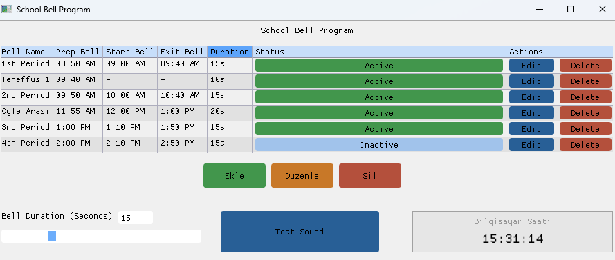

# 🔔 School Bell & Light Controller



A lightweight **C-based** controller utilizing **GLFW** for the interface and control logic. This project is designed to automate school bell systems and lighting schedules with high precision.

## 🚀 Features
* **Real-time Scheduling:** Precision timing for bell triggers and light switching.
* **GLFW Integration:** Leverages GLFW for cross-platform windowing and input handling.
* **Lightweight:** Minimal memory footprint, ideal for embedded or low-power systems.
* **Git Optimized:** Clean project structure for version control.

## 🛠 Prerequisites
Before building, ensure you have the following installed:
* **C Compiler:** GCC / MinGW (MinGW 13.1.0+ recommended)
* **Build System:** CMake (3.16+)
* **Libraries:** GLFW 3.x

## 🔨 Build Instructions

1. **Clone the repository:**
   ```bash
   git clone https://github.com/ThugRabbit/scholl-bell-light.git
   cd scholl-bell-light
   ```

2. **Configure with CMake:**
   ```bash
   mkdir build
   cd build
   cmake ..
   ```

3. **Compile:**
   ```bash
   # On Linux/macOS:
   make
   
   # On Windows (MinGW):
   mingw32-make
   ```

## 📂 Project Structure
* `src/` - Source files (`.c`, `.h`).
* `assets/` - Configuration files or schedule scripts.
* `include/` - External headers and library definitions.
* `CMakeLists.txt` - Build configuration.

## 📄 License
This project is licensed under the **MIT License**.